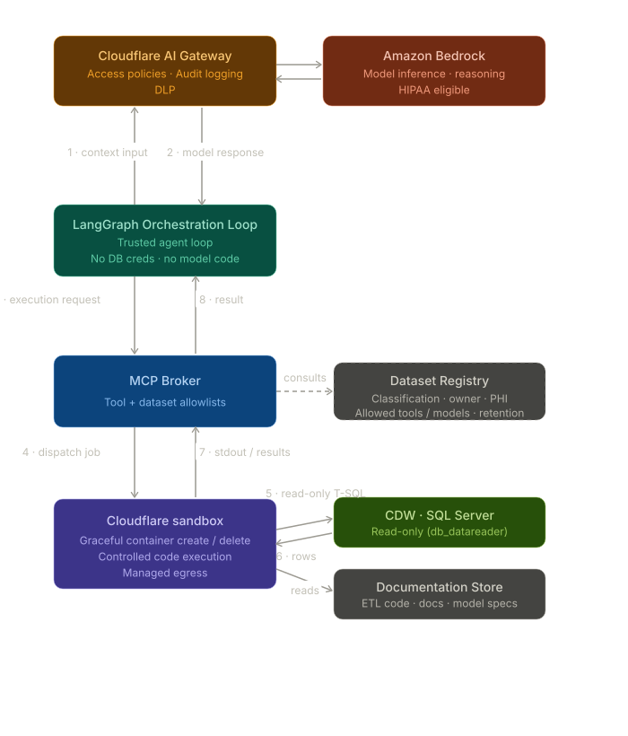

# AutoDQA — Autonomous Data Quality Assessment

An agent for autonomous data quality assessment of a clinical data warehouse (CDW): it profiles tables, detects data quality issues, and traces them through ETL code to root causes. Targets PCORnet CDM databases on SQL Server.

The design is **code-mode**: the agent reasons by writing code, and all model-authored code runs in an isolated sandbox rather than on the orchestrating host.

- **Reasoning** — Claude on **Amazon Bedrock** (`ChatBedrockConverse`), routed through a **Cloudflare AI Gateway** that holds the Bedrock credentials (BYOK) and signs the upstream requests
- **Orchestration** — a **LangGraph** loop (`create_agent`) hosted on **Bedrock AgentCore Runtime**: a trusted service that holds no DB credentials and runs no model-written code
- **Execution** — a per-session **AWS Lambda MicroVM** (Firecracker) that runs the agent's Python in isolation

## Architecture



The agent loop:

1. The user signs in to the web console (institutional **Cloudflare Pages** behind Cloudflare Access, then **Cognito**) and submits a task; the browser invokes the AgentCore Runtime directly with its Cognito JWT. The Runtime's LangGraph loop sends the conversation to Bedrock via the Cloudflare AI Gateway (access policies, audit logging, DLP).
2. Bedrock replies — either "run this code" or a final answer.
3. The Runtime passes the execution request to the **AgentCore Gateway** (MCP), which dispatches to the broker Lambda.
4. The broker enforces tool and dataset allowlists (consulting the dataset registry), retrieves credentials from the secrets vault (AWS Secrets Manager — the org is not licensed for Keeper, which the architecture diagram still names), and dispatches the code to a per-session **Lambda MicroVM** with credentials injected.
5. The sandbox code queries the CDW with read-only T-SQL (pure-Python pytds) and reads the documentation store (ETL code, docs).
6. Result rows are pulled back into the sandbox for analysis.
7. stdout/results return through the broker to the Runtime.
8. The Runtime appends the results and loops back to (1) until Bedrock produces a final answer, streaming each reason → act → observe step to the console.

See [`docs/target_architecture.md`](docs/target_architecture.md) for the trust model in detail.

Trust boundaries:

- **Orchestrator (AgentCore Runtime) = trusted** — no model-authored code, no DB credentials.
- **Sandbox = untrusted** — all model-written code is contained in a per-session Firecracker microVM, with egress via a managed connector.
- **Read-only is enforced at the DB login** (`db_datareader`), not by keyword filtering — once the agent writes arbitrary code, only the grant level guarantees read-only.

**Data tiering:** the stack runs on **synthetic data only** (Tier-0/1). The sandbox already reaches the institutional network in-network over a VPC egress connector, but pointing it at a *real* CDW additionally requires the Project Mermaid Tier 2+ controls (DLP, redacted logs, BAA-covered services). Today the MicroVM reaches the institutional **synthetic** SQL Server (`query_cdw`) directly over that VPC path, and the ETL source is a read-only snapshot **baked into the sandbox image** at `/opt/etl` — so there is no tunnel left in the data path at all.

## Repository layout

| Path | What it is |
|------|------------|
| `agentcore-runtime/` | The main agent — LangGraph loop on Bedrock AgentCore Runtime (`entrypoint.py`, `agent.py`) with the `query_cdw`, `search_etl`/`read_etl_file`, `run_python`, etc. tools |
| `agentcore-gateway/` | AgentCore Gateway + broker Lambda that exposes the tools over MCP (see its README) |
| `sandbox-microvm/` | AWS Lambda MicroVM image that runs untrusted model-written code (pytds baked in) |
| `frontend/` | Streaming web console (static files + Cognito login): submit a task and watch the agent reason/call tools/answer live. Served from the institutional Cloudflare Pages (behind Access) via the [autodqa-frontend](https://github.com/uthh-sbmi-ai/autodqa-frontend) mirror repo; the former CloudFront/S3 hosting is decommissioned |
| `orchestrator-worker/` | Earlier Cloudflare-hosted streaming console PoC (TS Worker), synthetic data only |
| `docs/target_architecture.md` | The code-mode architecture (diagram + trust model) |
| `docs/` | Project Mermaid security proposal, provider evaluations, PHI data-flow inventory |
| `config.yaml` | DB connection, ETL repo path, documentation paths, tables to assess |
| `legacy/` | Superseded code kept for reference: `legacy/notebook-agent/` (the original notebook agent) + the Claude Code multi-agent pipeline (see below) |

## Deploying the stack

The stack is AWS-native (plus the Cloudflare AI Gateway for Bedrock BYOK). Each component has its own README with exact commands; deploy in this order — later steps consume outputs of earlier ones:

1. **Sandbox image** — [`sandbox-microvm/`](sandbox-microvm/README.md): build the Lambda MicroVM image (pytds baked in). Writes the image ARN the gateway reads. Uses the Lambda MicroVM build API (CodeBuild-style, no local Docker).
2. **Gateway + broker** — [`agentcore-gateway/`](agentcore-gateway/README.md): `setup_gateway.py` vaults the CDW login, deploys the broker Lambda, and creates the AgentCore Gateway + MCP target. `test_gateway.py` smoke-tests it end to end.
3. **Runtime (the agent)** — `agentcore-runtime/deploy.sh` builds and launches the LangGraph agent on AgentCore Runtime (cloud CodeBuild ARM64; no local Docker). Inbound auth is the Cognito JWT authorizer, so the browser can invoke it directly.
4. **Web console** — [`frontend/`](frontend/): `setup_frontend.py` provisions Cognito (its CloudFront/S3 half is retired — see `decommission_cloudfront.py`). The UI itself deploys by running `frontend/stamp_revision.py frontend/index.html` (stamps the footer's revision date, which the institutional web standards require) and then pushing `index.html`/`app.js`/`config.js`/`uth_logo.svg`/`roboto-latin.woff2` to the [autodqa-frontend](https://github.com/uthh-sbmi-ai/autodqa-frontend) GitHub repo, which the institutional Cloudflare Pages serves behind Access.

### Shared prerequisites

- Python 3.11+ and the project venv (`.venv`); invoke tools explicitly as `./.venv/bin/*`.
- An AWS account with credentials (the deploy scripts use a named profile; the reference deployment runs on the institutional **BigARC** account).
- A **Cloudflare AI Gateway** with Bedrock BYOK credentials (IAM SigV4 keys for a Claude-enabled Bedrock account). The Runtime authenticates to it with `CF_AIG_TOKEN` (in `agentcore-runtime/.env` as `CF_ACCOUNT_ID` / `CF_AIG_GATEWAY` / `CF_AIG_TOKEN`) — no AWS Bedrock creds live in the container.
- `config.yaml` (gitignored; see `config.example.yaml`) — the CDW connection, ETL/doc paths, and tables. The gateway setup vaults the read-only DB login from here.
- The CDW is reached directly over the sandbox's VPC egress connector (`agentcore-gateway/setup_vpc_egress.py`) — no tunnel.
- The ETL source is **cloned from GitLab into the sandbox** on first use in a run, with a service-account SSH key from Secrets Manager (`agentcore-gateway/lambda/gitlab_clone.py`); `list_etl`/`read_etl`/`grep_etl`/`search_etl`/`read_etl_file` are then filesystem reads at `/tmp/etl-repo`. Point it with `GITLAB_ETL_REPO` — at the **synthetic** ETL repo, never production, since the two differ. This replaced two earlier designs: the ngrok-published bridge (`etl-bridge/`, retained but unused) and a snapshot baked into the image at `/opt/etl`. The baked snapshot's flaw was that any ETL change needed a full cloud image rebuild before the served source matched what the database runs — miss that and an ETL-origin defect becomes unattributable. Now updating the ETL is a git push. Smoke-test with `agentcore-gateway/test_etl.py`.

### `config.yaml`

```bash
cp config.example.yaml config.yaml
```

```yaml
id: "cdw"
name: "Clinical Data Warehouse"
engine: "mssql"
cdm: "pcornet"

connection:
  server: "<SERVER_NAME>"
  database: "<DATABASE_NAME>"
  uid: "<USERNAME>"
  pwd: "<PASSWORD>"

sources:
  etl:
    path: "<PATH_TO_ETL_REPO>"
  documentation:
    paths:
      - "<PATH_TO_ETL_REPO>/Documentation"

tables:
  - DEMOGRAPHIC
  - ENCOUNTER
  - DIAGNOSIS
```

**Notes:**
- Use a **read-only** DB login (`db_datareader`, no write/DDL) — read-only is enforced at the grant, not by keyword filtering.
- `query_cdw` connects with pure-Python **pytds** from inside the MicroVM (no ODBC driver needed).
- The `server`/`port`/`database` in `config.yaml` are baked into the broker Lambda at deploy as `CDW_SERVER`/`CDW_PORT`/`CDW_DATABASE`; the sandbox dials that endpoint over its VPC egress connector. To change the target DB, edit `config.yaml` and re-run `resume_setup.py`.

## Usage

Open the web console (the institutional Cloudflare Pages URL, behind Cloudflare Access), sign in with your Cognito user, and submit a data-quality task. The console streams each reason → act → observe step: the architecture diagram lights up along the active path, tool calls and results appear inline, and you see the sandbox microVM spin up and down.

Headless smoke tests (no browser):
- `agentcore-gateway/test_gateway.py` — gateway → Lambda → sandbox round trip.
- `frontend/invoke_jwt.py` — full Runtime invoke with a Cognito bearer token.

It is **Tier-0/1 by design: synthetic data only.** Do not point it at real CDW data — that requires the Project Mermaid Tier 2+ controls (DLP, redacted logs, BAA-covered services).

## Legacy (deprecated — kept for reference)

Two earlier implementations live under `legacy/`; don't build on them.

**Notebook agent** — [`legacy/notebook-agent/`](legacy/notebook-agent/README.md): the original AutoDQA agent (`autodqa_agent.ipynb`), Bedrock + a local LangGraph loop that executed code in the retired **Cloudflare sandbox worker**. Superseded by the AgentCore stack above; won't run as-is (its Cloudflare sandbox was decommissioned).

**Claude Code pipeline** — the first implementation: a multi-agent pipeline built on Claude Code headless mode (`claude -p`), where a coordinator agent orchestrated profiler, analyst, investigator, reviewer, and report-writer sub-agents through seven phases, communicating via JSON files and reaching the CDW through MCP tool servers. It lives in [`legacy/`](legacy/README.md) and remains runnable from the repo root:

```bash
./legacy/run.sh --config config.yaml
```

Its pieces: `legacy/run.sh` (launcher), the role instruction files (`legacy/COORDINATOR.md`, `PROFILER.md`, `ANALYST.md`, `INVESTIGATOR.md`, `REVIEW.md`, `REPORT_WRITER.md`), the MCP servers in `legacy/tools/`, and the full design in [`docs/architecture.md`](docs/architecture.md). Output from a pipeline run lands in `legacy/results/<YYYY-MM-DD>_<db_id>_dqa/`.
