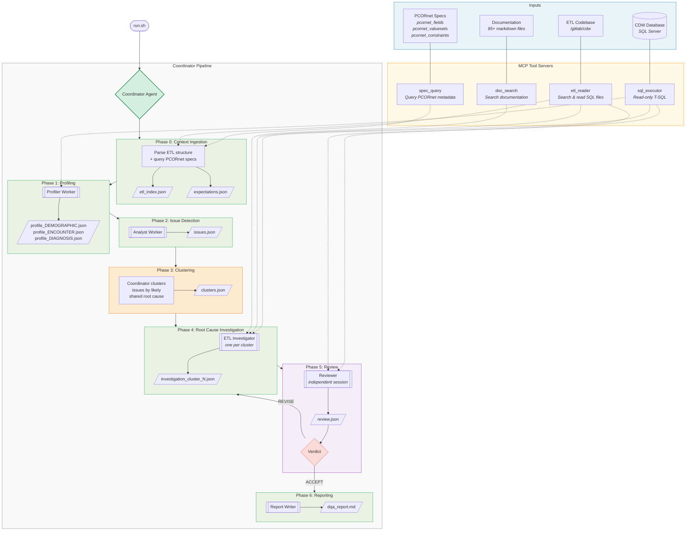

# AutoDQA — Architecture

## Agent Legend

| Shape | Meaning |
|-------|---------|
| `[[ ]]` double-bordered | Sub-agent (independent Claude Code session via `claude -p`) |
| `{ }` diamond | Decision point (coordinator or reviewer verdict) |
| `/ /` parallelogram | Output file (JSON or markdown) |
| Dotted lines | Tool connections (which tools each agent uses) |

## Key Design Points

- **Clustering is the coordinator's job** (Phase 3, orange) — it groups related issues before spawning investigators, so each investigator traces a coherent set of symptoms to a single root cause.
- **Review is independent** (Phase 5, purple) — the reviewer runs in a fresh session with no access to prior agents' reasoning.
- **REVISE loops back** to investigation, not to the beginning — the reviewer can send specific clusters back for re-investigation while accepting the rest.
