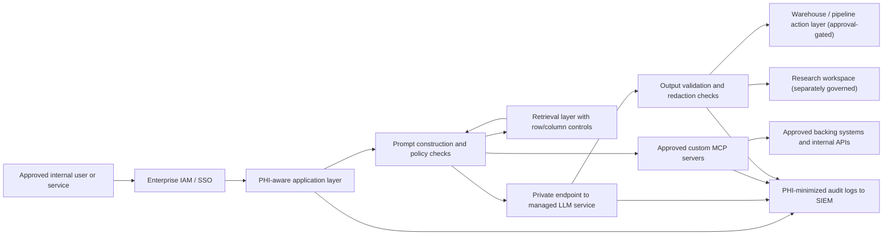
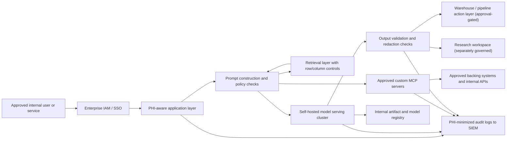
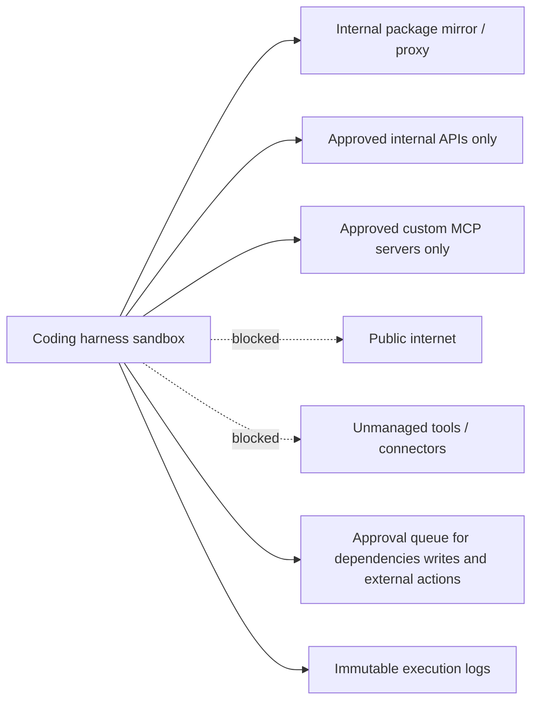

# Reference Architecture for Strict-PHI LLM Workloads

This document defines two approved evaluation tracks:

- `Track A`: Hyperscaler-managed AI inside enterprise cloud controls
- `Track B`: Self-hosted or local compute for the highest-sensitivity PHI workloads

Both tracks assume:

- PHI may be present in prompts, retrieved context, outputs, logs, and tool inputs
- The coding harness has no direct public internet access
- Package installation is allowed only through an internal mirror or proxy
- Operational and research workloads are separated logically and administratively
- Custom MCP servers are treated as governed service boundaries, not trusted local helpers

## Shared control plane requirements

- Identity through enterprise SSO and centralized IAM
- Service-to-service access through scoped service identities only
- Separate environments for development, testing, research, and production
- Policy enforcement for row-level, column-level, and workload-level PHI access
- Centralized logging to the enterprise SIEM with PHI-minimizing defaults
- Approval workflows for dependency additions, schema changes, production writes, and research exports
- Allowlisting and approval for every custom MCP server, including its backing systems and permitted actions

## Track A: Hyperscaler-managed AI

### Intended use

- Default path for most operational and engineering workloads
- Allowed only when exact PHI-covered features are explicitly confirmed
- Preferred when managed networking, IAM, audit, and reliability capabilities reduce implementation risk

### Control requirements

- Private endpoint connectivity or equivalent service-boundary controls
- Explicit deny for unapproved features such as web search or unmanaged external connectors
- Vendor and feature coverage documented under the BAA or equivalent contractual terms
- Centralized audit export for identity, network, and model activity

### Logical flow

### Notes

- The managed LLM service must sit behind approved private networking and identity controls.
- Any ambiguous provider feature remains disabled until cleared.
- Research access should use a separate governed workspace even if the same provider is reused.
- Custom MCP servers must be explicitly allowlisted, authenticated with scoped identities, and blocked from reaching unapproved destinations.

## Track B: Self-hosted or local compute

### Intended use

- Highest-sensitivity PHI workflows
- Workloads where provider feature coverage is too narrow or legally ambiguous
- Use cases requiring maximum control over storage, logs, retention, and model execution boundaries

### Control requirements

- Model serving runs inside your governed cloud tenant or tightly controlled datacenter boundary
- Model artifacts come from approved sources with provenance validation
- Admin access is limited, fully logged, and regularly reviewed
- Patching, vulnerability management, GPU capacity, and break-glass procedures are documented

### Logical flow

### Notes

- “Local compute” should be interpreted as governed compute inside an approved enterprise boundary, not ad hoc developer workstations.
- This track increases direct control but also increases operational and security burden.
- Self-hosted MCP servers inherit the same hardening, patching, and audit requirements as self-hosted model infrastructure.

## Coding harness control overlay

The coding harness sits behind either deployment track and must obey the same network and approval model.

## Approval guidance

- Prefer `Track A` when provider feature coverage is explicit and the managed service meets networking, IAM, and audit requirements.
- Use `Track B` for the most sensitive PHI use cases or when legal or technical ambiguity remains.
- Reject any architecture that cannot prove bounded logging, bounded egress, policy-based separation of operational and research PHI workflows, and explicit control over custom MCP servers.
