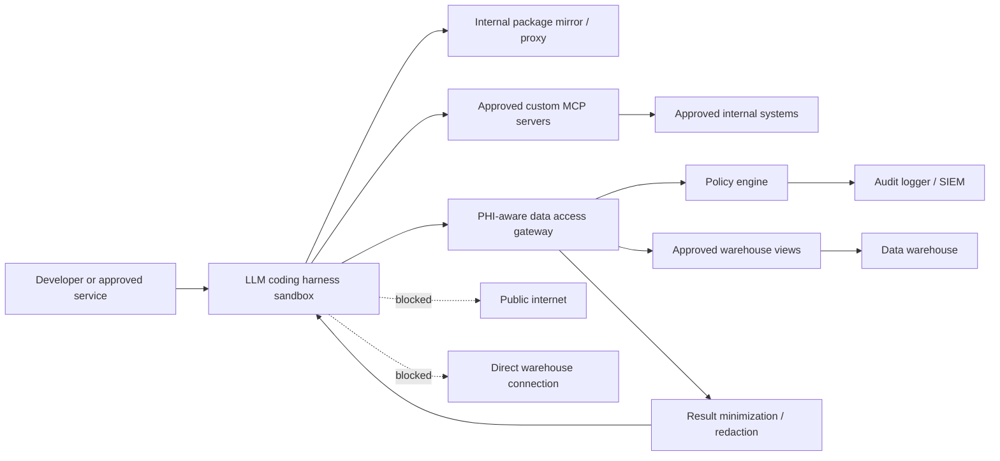

# Secure Coding Harness Design for Strict-PHI EHR Workloads

## Summary

This design describes how to run an LLM-powered coding harness, such as Claude Code or a similar agentic development tool, in a way that limits the risk of PHI exposure if generated code, tool execution, or a downloaded package is malicious.

The core pattern is to separate unsafe or semi-trusted activity from PHI-bearing systems:

- Package installation and exploratory code execution happen in an isolated build/test sandbox with no PHI access.
- PHI access happens only through a policy-enforcing data gateway.
- Any PHI execution environment uses locked, pre-approved dependencies and no runtime package installation.
- The harness never receives direct warehouse credentials.

## Goals

- Allow the team to use an LLM coding harness for data pipeline improvement, SQL analysis, and research support.
- Prevent infected packages from stealing PHI, credentials, cached query results, or warehouse extracts.
- Enforce minimum-necessary access to EHR data through a central proxy.
- Keep all package installation, tool execution, SQL requests, and MCP server calls auditable.
- Support both hyperscaler-hosted LLMs and self-hosted or local compute options.

## Non-goals

- This design does not make arbitrary packages safe.
- This design does not allow direct public internet access from the harness.
- This design does not allow direct SQL access from the harness to the data warehouse.
- This design does not replace legal, privacy, IRB, or HIPAA Security Rule review.

## High-level architecture



## Trust boundaries

| Boundary | Trust level | Design rule |
| --- | --- | --- |
| LLM coding harness sandbox | Semi-trusted | May run generated code, but has no PHI credentials and no public egress |
| Internal package mirror | Trusted with controls | Only serves approved, scanned, pinned packages |
| Data access gateway | High trust | Sole path from harness to PHI-bearing warehouse data |
| PHI execution zone | High trust | Runs only prebuilt approved images and cannot install packages at runtime |
| MCP servers | Conditional trust | Must be allowlisted, scoped, logged, and blocked from unapproved egress |
| Data warehouse | High trust | Never directly reachable from the harness |

## Core components

### 1. Coding harness sandbox

The sandbox hosts the LLM-powered coding tool and executes generated code against synthetic, de-identified, or tightly minimized data.

Required controls:

- No direct data warehouse credentials.
- No direct public internet egress.
- No mounted PHI datasets.
- No long-lived secrets in environment variables, local files, shell history, or config files.
- Ephemeral lifecycle, ideally destroyed after each task or session.
- Read-only base filesystem with a small writable workspace and temp directory.
- CPU, memory, disk, process, and runtime limits.
- Full command, package, file-write, and network-attempt logging.

### 2. Internal package mirror

The internal package mirror is the only package source available to the harness.

Required controls:

- Allowlisted package names and versions.
- Pinned dependencies and lockfiles.
- Malware scanning.
- License review.
- SBOM generation where feasible.
- Dependency confusion protection.
- Immutable logs for package resolution and installation.
- Human approval workflow for new packages or version changes.

Recommended package flow:

```text
Public registry
  -> security scan and license review
  -> internal package mirror
  -> build/test sandbox
```

The sandbox should never fetch directly from PyPI, npm, GitHub, model hubs, curl endpoints, or arbitrary URLs.

### 3. PHI-aware data access gateway

The data access gateway is the only approved path from the harness to EHR data.

Responsibilities:

- Authenticate the harness with short-lived task-scoped credentials.
- Authorize every request based on user, workload, environment, dataset, purpose, and approval state.
- Validate, rewrite, or reject SQL.
- Enforce row-level and column-level access.
- Restrict access to approved schemas, views, and stored procedures.
- Block broad patient-level pulls unless explicitly approved.
- Apply result limits, aggregation requirements, and redaction where appropriate.
- Log the original request, policy decision, executed query, row counts, accessed objects, and returned sensitivity class.

The gateway should default to read-only access. Writes, DDL, exports, cross-dataset linkage, and production pipeline changes should require explicit approval.

### 4. PHI execution zone

Some tasks may need to execute code against PHI. Those tasks should run in a separate locked-down zone, not in the general build/test sandbox.

Required controls:

- Prebuilt approved runtime images only.
- No runtime package installation.
- No public internet egress.
- Access only through the data gateway or approved internal APIs.
- Separate service identities from the build/test sandbox.
- Stronger monitoring, approval gates, and retention controls.
- Short task windows and automatic cleanup.

Recommended flow:

```text
Build/test sandbox
  -> develop and test with synthetic or de-identified data
  -> security and dependency checks
  -> approved immutable runtime image
  -> PHI execution zone
  -> data gateway
  -> approved warehouse views
```

### 5. Custom MCP servers

Custom MCP servers should be treated as governed service integrations, not local helper scripts.

Required controls:

- MCP server allowlist by name, version, owner, environment, and backing system.
- Scoped authentication per server and per action.
- No access to raw warehouse credentials unless the server itself is the approved data gateway.
- Network allowlist for backing systems.
- PHI-safe logging rules.
- Immutable audit traces for requests, responses, and side effects.
- Human approval gates for sensitive actions.
- Vulnerability management and secrets rotation for each server.

MCP servers that can read PHI, write data, export files, install packages, call external APIs, or modify pipeline code should be treated as high-risk integrations.

## Request flow

### Safe development flow

1. User asks the harness to inspect or improve a data pipeline.
2. Harness runs in the build/test sandbox.
3. Harness installs only approved packages from the internal mirror.
4. Harness uses synthetic, sampled, de-identified, or gateway-minimized data.
5. Harness proposes code, SQL, or pipeline changes.
6. Tests run in the sandbox.
7. Proposed changes go through review before deployment.

### PHI query flow

1. Harness sends a structured data request to the data gateway.
2. Gateway authenticates the task and maps it to the user, workload, and purpose.
3. Policy engine checks whether the requested data is allowed.
4. Gateway validates or rewrites SQL against approved views.
5. Gateway executes using its own scoped warehouse role.
6. Gateway minimizes or redacts results.
7. Gateway logs the decision and result sensitivity.
8. Harness receives only the approved result.

### Blocked flow

The following actions should fail closed:

- Direct SQL connection from harness to warehouse.
- Direct package installation from public registries.
- Calls to unapproved URLs.
- MCP server calls to unapproved backing systems.
- Queries returning unrestricted patient-level PHI.
- Runtime package installation inside the PHI execution zone.
- Exports from research or PHI environments without approval.

## Policy examples

### Query policy

| Request type | Default decision | Required approval |
| --- | --- | --- |
| Aggregate count over approved view | Allow | No |
| Read limited rows from approved de-identified view | Allow | No |
| Read patient-level PHI | Deny by default | Privacy or designated data steward |
| Join multiple PHI datasets | Deny by default | Privacy, security, and research governance |
| Export result outside governed environment | Deny by default | Legal and privacy |
| DDL or production warehouse write | Deny by default | Platform owner and change approval |

### Package policy

| Package action | Default decision | Required approval |
| --- | --- | --- |
| Install pinned approved package from mirror | Allow | No |
| Install unapproved package | Deny | Security and platform review |
| Install from public URL or Git repo | Deny | Exception-only review |
| Install package with known critical CVE | Deny | Security exception |
| Install package in PHI execution zone | Deny | Not allowed by default |

### MCP policy

| MCP action | Default decision | Required approval |
| --- | --- | --- |
| Read approved metadata from internal catalog | Allow | No |
| Query PHI through data gateway MCP server | Conditional | Data policy approval |
| Write pipeline code or config | Deny by default | Code review and platform approval |
| Export files or send external request | Deny by default | Legal, privacy, and security |
| Call unregistered MCP server | Deny | Register and review server first |

## Logging and audit requirements

Capture:

- User identity and task identity.
- Harness session ID.
- LLM provider and model identifier.
- Package install attempts and resolved artifacts.
- Command execution metadata.
- Network connection attempts.
- MCP server calls and backing-system accesses.
- Data gateway requests, policy decisions, executed queries, row counts, and sensitivity class.
- Approval decisions and approvers.
- Code diffs, deployment artifacts, and runtime image identifiers.

Avoid:

- Raw PHI in developer-facing logs.
- Full prompt and completion logging unless explicitly approved and protected.
- Secrets in logs, traces, error messages, or package installer output.

## Security testing

Run these tests before PHI access is approved:

- Attempt direct warehouse connection from the harness and verify it fails.
- Attempt public internet egress and verify it fails.
- Attempt package installation from public registries and verify it fails.
- Attempt dependency confusion with an internal package name and verify it fails.
- Attempt to read environment variables, secrets, home directories, temp files, and mounted volumes.
- Attempt prompt injection that asks the harness to exfiltrate PHI.
- Attempt SQL that selects unrestricted patient-level data.
- Attempt MCP calls to unapproved servers and backing systems.
- Attempt runtime package installation in the PHI execution zone.
- Verify logs are sufficient for audit without exposing raw PHI unnecessarily.

## Implementation phases

### Phase 1: Non-PHI prototype

- Build the harness sandbox with no public egress.
- Configure internal package mirror access.
- Use synthetic or de-identified datasets only.
- Add command, package, and network-attempt logging.
- Prove direct warehouse access is blocked.

### Phase 2: Data gateway pilot

- Implement read-only gateway access to approved non-PHI or de-identified views.
- Add SQL validation, result limits, and audit logging.
- Add approval workflow for exceptional queries.
- Validate SIEM integration.

### Phase 3: Strict-PHI controlled pilot

- Add PHI access only through approved views and gateway policy.
- Use short-lived credentials and workload-specific roles.
- Run red-team tests.
- Complete legal, privacy, security, and platform approval.

### Phase 4: Production hardening

- Add immutable runtime images for PHI execution.
- Add vulnerability scanning and SBOM enforcement.
- Add MCP server registry and per-server approval workflow.
- Add continuous monitoring, access reviews, incident runbooks, and break-glass procedures.

## Minimum acceptance criteria

- The harness cannot reach the warehouse directly.
- The harness cannot reach the public internet directly.
- The harness cannot install unapproved packages.
- The harness has no long-lived PHI credentials.
- PHI is available only through the data gateway.
- PHI execution uses approved images with no runtime package installation.
- Custom MCP servers are allowlisted, scoped, and logged.
- Audit logs can explain who requested what, why it was allowed or denied, what data was accessed, and what code or output resulted.

## Open decisions

- Which warehouse objects should be exposed through approved views first?
- Which package registries and languages need internal mirror support?
- Which actions require human approval versus automated policy approval?
- Whether the first PHI pilot should use Bedrock, another hyperscaler path, or self-hosted/local compute.
- Which MCP servers are necessary for the first pilot and who owns each server.
