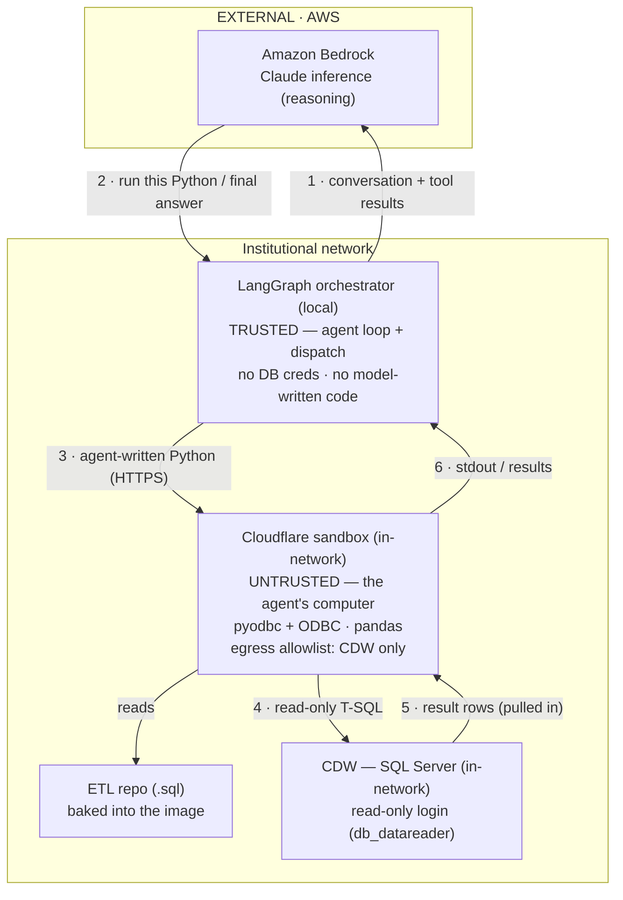

# Target Architecture — Bedrock + LangGraph + Cloudflare (code-mode)

This is the **target design** for the experimental AutoDQA agent that runs on
Amazon Bedrock (reasoning), LangGraph (orchestration), and a Cloudflare sandbox
(execution). It is distinct from the Claude Code-based pipeline documented in
[`architecture.md`](architecture.md).

The design is **code-mode**: the LangGraph orchestrator stays local and trusted,
while *all model-authored code* runs inside an in-network Cloudflare sandbox that
is provisioned as the agent's "computer" — it holds a read-only DB connection,
the ETL repo, and analysis libraries, and queries the CDW (which lives outside
the container) over the network.

> Status: target/experimental. Prerequisites before implementation — a custom
> sandbox image with `pyodbc` + ODBC driver (needs Docker), the ETL repo baked
> into that image, the in-network sandbox endpoint, and a read-only DB login
> reachable from the container.

## Diagram

## The loop

1. The orchestrator sends the conversation so far to Bedrock.
2. Bedrock replies — either "run this Python" or a final answer.
3. The orchestrator ships the agent-written code to the sandbox (HTTPS).
4. The code queries the CDW read-only.
5. Result rows are pulled back into the container, where the code also reads ETL
   files and computes.
6. Results return to the orchestrator, which appends them and loops back to (1)
   until Bedrock produces a final answer.

## Trust & boundaries

- Everything below the network boundary — orchestrator, sandbox, CDW — runs
  **inside the institutional network**. Only **Bedrock is external**.
- **Orchestrator = trusted**: it runs no model-authored code and holds no DB
  credentials.
- **Sandbox = untrusted**: all model-authored code is contained here, in a
  Firecracker microVM.
- **Read-only is enforced at the DB login** (`db_datareader`, no write/DDL), not
  a keyword filter — once the agent can write arbitrary code, only the grant
  level can guarantee read-only.
- **Sandbox egress is allowlisted** to the CDW (defense in depth against a
  prompt-injected agent exfiltrating data).
- **Data-flow note:** the context sent to Bedrock at step (1) includes prior tool
  results, which can contain CDW data — so that AWS path carries data out of the
  network and should run under a compliant/BAA Bedrock configuration.
